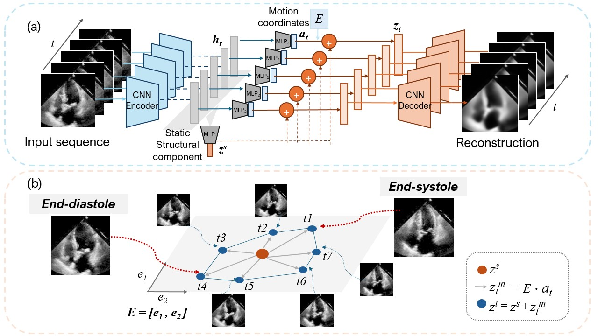

# Latent Motion Profiling for Annotation-Free Cardiac Phase Detection

This repository contains the official implementation of the paper:

**"Latent Motion Profiling for Annotation-Free Cardiac Phase Detection in Adult and Fetal Echocardiography Videos"**  
Early Accepted at MICCAI 2025 🎉  

[[📄 Paper Link (TBA)]](https://example.com)

---

## 🧠 Overview



We propose an **unsupervised, annotation-free method** to detect key cardiac phases—end-diastole (ED) and end-systole (ES)—from echocardiography videos.  
Our method learns **interpretable motion trajectories** in a low-dimensional latent space without any labels, segmentations, or volume data.

Highlights:
- ✅ No annotations required
- 👶 Works on both adult and fetal echocardiograms
- 🩺 Matches supervised SOTA performance (MAE ~2–3 frames)
- 🌍 Scalable and generalizable for real-world clinical use

---

## 🏗️ Project Structure

```bash
.
├── example/              # Example for latent trajectory visulaization and ED/ES extraction 
├── models/               # Encoder/decoder architecture and latent motion module
├── configs/              # Config file for EchoNet-Dynamic
├── EchoDynamicDataset.py # Dataloaders for EchoNet-Dynamic
├── train.py              # Training pipeline
├── evaluate.py           # evaluation
├── utils.py              # Functions for trajectory analysis
├── EDESextraction.ipynb  # ED ES detection example
├── requirements.txt 
└── README.md
```

---

## 🚀 Getting Started

### 1. Clone the repo

```bash
git clone https://github.com/YingyuYyy/CardiacPhase.git
cd CardiacPhase
```

### 2. Installation Instructions

#### 📦 Step 1: Create and activate a new environment
```bash
conda create -n CardiacPhase python=3.10
conda activate CardiacPhase
```

#### 🚀 Step 2: Install PyTorch with CUDA 12.5 support
```bash
pip install torch==2.5.1 torchvision==0.20.1 torchaudio==2.5.1 --index-url https://download.pytorch.org/whl/cu124
```

#### 📄 Step 3: Install remaining Python dependencies
```bash
pip install -r requirements.txt
```

### 3. Prepare datasets

- **Adult (EchoNet-Dynamic)**: Follow [this link](https://echonet.github.io/dynamic/) to download the dataset.
- **Fetal**: Please customize for your own dataset. Preprocessed videos should be resized to `128x128` and aligned to canonical 4CH view.

### 4. Train the model

```bash
python train.py --config configs/EchoNetConfig.yaml
```

### 5. Evaluate cardiac phase detection

- Please use evaluate.py to predict latent motion trajectories once you have trained your model on EchoNet-Dynamic.
- EDESextraction.ipynb has provided an example to extract ED/ES frames from latent motion trajectory using the provided example data in /examples. 

---

## 📊 Results

| Dataset     | Metric        | ED MAE (ms) | ES MAE (ms) |
|-------------|----------------|-------------|-------------|
| Adult       | Match-pair     | 58.3        | 39.8        |
| Fetal       | Match-pair     | 20.7        | 25.3        |

---

## 📈 Citation

If you use this code or find it helpful, please cite (official citation coming soon):

```bibtex
@inproceedings{LatentYang,
  title     = {Latent Motion Profiling for Annotation-Free Cardiac Phase Detection in Adult and Fetal Echocardiography Videos},
  author    = {Y Yang et al.},
  booktitle = {MICCAI},
  year      = {2025}
}
```

---

## Acknowledgements

TVAE: https://github.com/alain-ryser/tvae 
LIA: https://github.com/wyhsirius/LIA 

---

## 🔒 License

Creative Commons Attribution-NonCommercial 4.0 International (CC BY-NC 4.0). See `LICENSE` for details.

